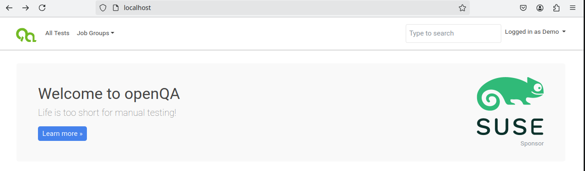
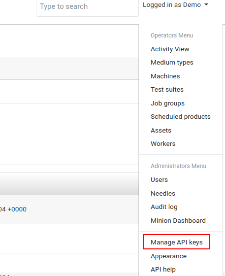
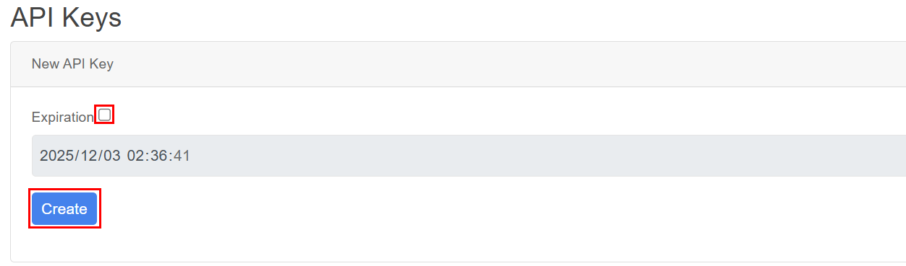
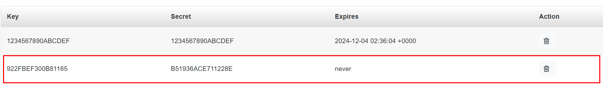
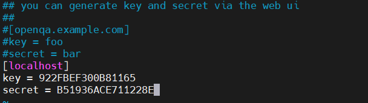
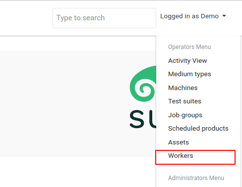
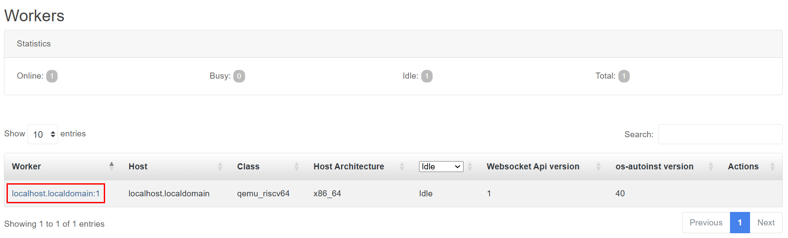
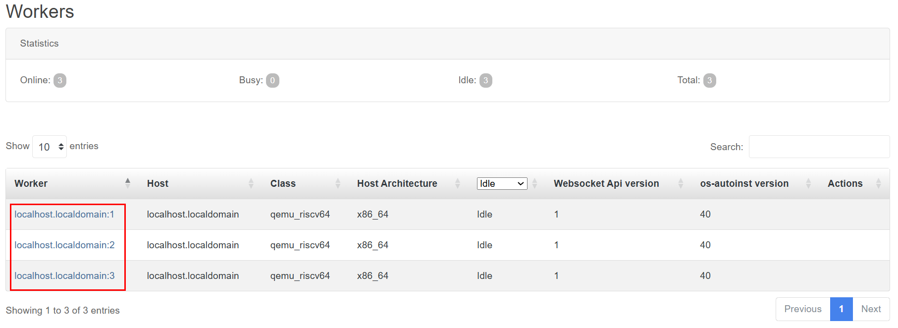
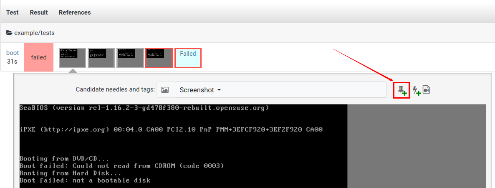
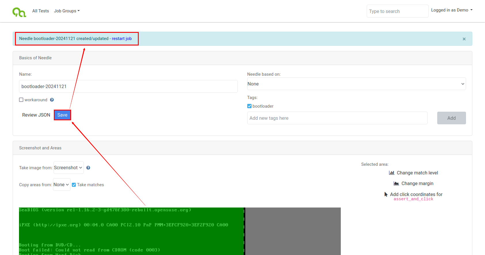

# openQA 用户手册

## 介绍

针对 openEuler riscv qcow2 格式镜像使用 openQA 进行系统的自动化测试

## openQA部署

### 安装openSUSE

使用openSUSE部署openQA，此处使用的版本是 [openSUSE-Leap-15.6-DVD-x86_64-Media.iso](https://download.opensuse.org/distribution/leap/15.6/iso/)，在x86实体机或虚拟机中安装

安装完成后，如需 ssh 连接，使用 root 用户运行以下命令进行设置，后续所有操作直接在 root 用户下进行

```sh
$ systemctl start sshd
$ systemctl enable sshd
$ systemctl stop firewalld
$ systemctl disable firewalld
```

### 安装openQA

安装openQA server：

```sh
$ zypper in openQA
```

安装openQA worker：

```sh
$ zypper in openQA-worker
```

### 基础配置

（1）对于本地实例，运行命令

```sh
$ /usr/share/openqa/script/configure-web-proxy
```

将自动安装本地Apache http代理。

（2）配置apache proxy，正常如下配置都已经配置了，这里再执行一次，确保正确

```sh
$ a2enmod headers
$ a2enmod proxy
$ a2enmod proxy_http
$ a2enmod proxy_wstunnel
$ a2enmod rewrite
```

可以通过 `a2enmod -l` 检查启用了哪些模块

（3）将 openqa.conf.template 复制到 openqa.conf，并根据需要修改 ServerName 设置

```sh
$ cp /etc/apache2/vhosts.d/openqa.conf.template /etc/apache2/vhosts.d/openqa.conf
```

（4）不启用https的配置，编辑 /etc/openqa/openqa.ini 文件，确认如下位置设置为0

```ini
[openid]
httpsonly = 0
```

（5）编辑 /etc/openqa/openqa.ini 文件，其中auth字段设置Fake模式

```ini
[auth]
method = Fake
```

（6）默认系统中没有 qemu-system-riscv64，即使有也推荐进行以下安装

1. 安装依赖

```sh
$ zypper install ninja gcc gcc-c++ glib2-devel libfdt-devel zlib-devel libaio-devel libusb-1_0-devel cmake
$ zypper install libSDL2-devel gtk3-devel libvirt-devel libpixman-1-0-devel alsa-devel libiscsi-devel libzstd-devel xz-devel meson pkgconf
$ zypper install libslirp-devel
```

2. 源码编译 qemu

```sh
$ wget https://download.qemu.org/qemu-9.0.1.tar.xz
$ tar xvJf qemu-9.0.1.tar.xz
$ cd qemu-9.0.1
$ ./configure --prefix=/usr --target-list=riscv64-softmmu,riscv64-linux-user --enable-sdl --enable-slirp --enable-vnc --enable-debug --enable-tools --enable-system
$ make -j$(nproc)
$ make install
```

上述命令会自动将 qemu-system-riscv64 安装到 /usr/bin 目录下

3. 验证

```sh
$ qemu-system-riscv64 --version
```

（7）编辑 /etc/openqa/worker.ini 文件，添加支持RISC-V的`BACKEND`和`WORKER_CLASS`

```ini
[global]
BACKEND=qemu
QEMU_SYSTEM_BINARY=/usr/bin/qemu-system-riscv64
WORKER_CLASS=qemu_riscv64
```

### 启动web ui和worker

（1）启动WEB UI，并设置开机自启动

```sh
$ systemctl enable --now postgresql
$ systemctl enable --now openqa-webui
$ systemctl enable --now openqa-scheduler
# to use Apache as reverse proxy under openSUSE
$ systemctl enable apache2
$ systemctl restart apache2
```

（2）确保已关闭防火墙，并禁用开机自启

```sh
$ systemctl stop firewalld
$ systemctl disable firewalld
```

（3）本机在浏览器输入localhost可访问 openQA web ui，局域网其他机器在浏览器通过服务器IP地址同样可以访问



（4）点击“Manage API Keys”



（5）取消勾选过期时间后，点击“Create”，然后下面就会生成新的key和secret



创建成功



（6）拷贝新建的key和secret，然后在安装openQA的服务器上编辑 /etc/openqa/client.conf 文件，在如下位置填入key和secret



（7）启动openQA-worker

```sh
$ systemctl start openqa-worker@1
```

（8）查看workers



（9）如下图所示，已经存在一个worker了



（10）也可以再增加几个worker，执行如下命令即可，只需要改变@符号后的数字（不必要）

```sh
$ systemctl start openqa-worker@2
$ systemctl start openqa-worker@3
```

（11）再次查看worker，可以发现此时已经存在3个worker了



（12）设置worker开机自启动

```sh
$ systemctl enable openqa-worker@1
```

至此基于 openSUSE 系统 openQA 已经部署完成了

## 使用openEuler qcow2镜像进行测试

（1）获取资产（openEuler qcow2镜像、bios固件），可从以下链接获得 [2403LTS-test/v1/QEMU/](https://mirror.iscas.ac.cn/openeuler-sig-riscv/openEuler-RISC-V/testing/2403LTS-test/v1/QEMU/) 或者是使用自己构建的系统镜像，qcow2镜像需要放置到 /var/lib/openqa/share/factory/hdd/ 目录下，bios固件可以放置到 /var/lib/openqa/share/factory/other/ 目录下

```sh
$ cd /var/lib/openqa/share/factory/hdd/
$ wget https://mirror.iscas.ac.cn/openeuler-sig-riscv/openEuler-RISC-V/testing/2403LTS-test/v1/QEMU/openEuler-24.03-V1-base-qemu-testing-uefi.qcow2.zst
$ zstd -d openEuler-24.03-V1-base-qemu-testing-uefi.qcow2.zst
$ cd ../other/
$ wget https://mirror.iscas.ac.cn/openeuler-sig-riscv/openEuler-RISC-V/testing/2403LTS-test/v1/QEMU/fw_payload_oe_uboot_2304.bin
```

（2）获取测试用例，可以将其放置到 /var/lib/openqa/tests/ 目录下，目录名修改为 openeuler

```sh
$ cd /var/lib/openqa/tests/
$ git clone https://github.com/SunInHeart/os-autoinst-distri-openeuler-riscv.git
$ mv os-autoinst-distri-openeuler-riscv openeuler
```

（3）运行测试

```sh
$ openqa-cli schedule --monitor \
    --param-file SCENARIO_DEFINITIONS_YAML=/var/lib/openqa/tests/openeuler/scenario-definitions.yaml \
    DISTRI=openeuler VERSION=0 FLAVOR=dev ARCH=riscv64 \
    TEST=legacy_boot _GROUP_ID=0 BUILD=test \
    CASEDIR=/var/lib/openqa/tests/openeuler \
    NEEDLES_DIR=%%CASEDIR%%/needles \
    HDD_1=openEuler-24.03-V1-base-qemu-testing-uefi.qcow2 \
    BIOS=/var/lib/openqa/factory/other/fw_payload_oe_uboot_2304.bin
```

## 自定义测试

### 编写testcase

参考上述测试用例中的tests目录下的.pm编写所需用例

### 添加needles

测试运行失败时，参考以下两个图通过 needle editor 创建新 needle





直接点击 `restart job` 即可重新运行，新测试用例需要运行多次从而完成 needle 添加

需要注意的是 needles 目录需要有写权限，否则提示权限拒绝


直接赋予 needles 目录所有权限

```sh
$ cd /var/lib/openqa/tests/openeuler
$ chmod 777 needles/
```

## 参考

* [openQA官方文档](https://open.qa/docs/)
