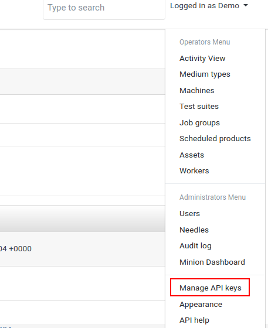
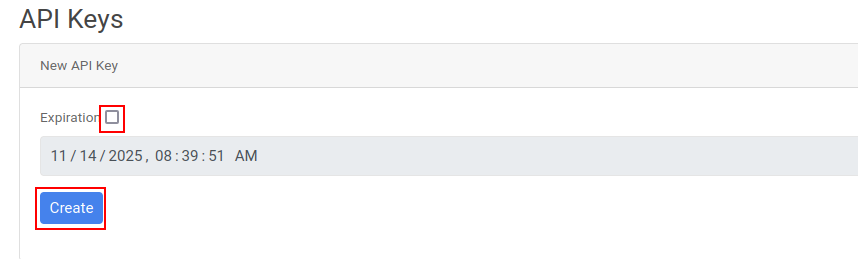
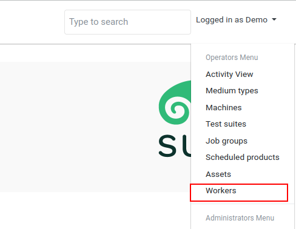
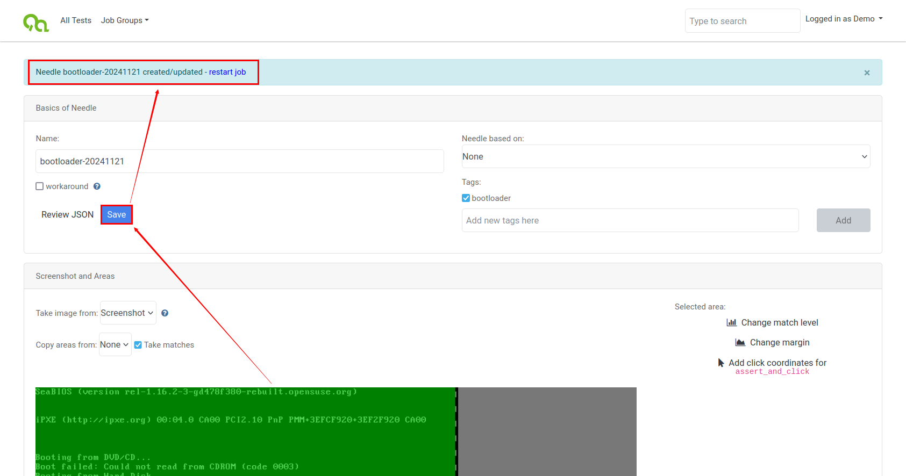

# openQA开发文档

## 目标

实现对 openEuler riscv qcow2 格式镜像使用 openQA 进行系统的自动化测试，本文档记录了开发过程中的各种尝试以及整体思路，如需简单测试直接参考 [《用户使用文档》](./openQA_User_Manual.md)。

## 基于openSUSE部署openQA

因为使用openQA-bootstrap安装如果网络环境较差的话，在克隆代码时会遇到种种问题，因此此处没有直接使用openQA-bootstrap脚本进行自动安装

手动安装步骤：

### 安装openQA

安装openQA server：

```sh
# openSUSE
zypper in openQA
```

安装openQA worker：

```sh
# openSUSE
zypper in openQA-worker
```

### 基础配置

（1）本地实例安装

```sh
/usr/share/openqa/script/configure-web-proxy
```

将自动安装本地Apache http代理。

（2）配置apache proxy，正常如下配置都已经配置了，这里再执行一次，确保正确

```sh
# openSUSE only
a2enmod headers
a2enmod proxy
a2enmod proxy_http
a2enmod proxy_wstunnel
a2enmod rewrite
```

可以通过 `a2enmod -l` 检查启用了哪些模块

（3）将 openqa.conf.template 复制到 openqa.conf，并根据需要修改 ServerName 设置

```sh
cp /etc/apache2/vhosts.d/openqa.conf.template /etc/apache2/vhosts.d/openqa.conf
```

（4）这里先按照不启用https的配置，编辑 /etc/openqa/openqa.ini 文件，确认如下位置设置为0

```ini
[openid]
httpsonly = 0
```

（5）编辑 /etc/openqa/openqa.ini 文件，其中auth字段设置Fake模式

```ini
[auth]
method = Fake
```

### 启动web ui与worker

（1）启动WEB UI，并设置开机自启动

```sh
systemctl enable --now postgresql
systemctl enable --now openqa-webui
systemctl enable --now openqa-scheduler
# to use Apache as reverse proxy under openSUSE
systemctl enable apache2
systemctl restart apache2
```

（2）关闭防火墙，并禁用开机自启

```sh
systemctl stop firewalld
systemctl disable firewalld
```

（3）在浏览器通过服务器IP地址和80端口即可访问


（4）点击“Manage API Keys”



（5）取消勾选过期时间后，点击“Create”，然后下面就会生成新的key和secret



（6）拷贝新建的key和Secret，然后在安装openQA的服务器上编辑/etc/openqa/client.conf 文件，在如下位置填入key和Secret


（7）启动openQA-worker

```sh
systemctl start openqa-worker@1
```

（8）查看workers



（9）如下图所示，已经存在一个worker了


（10）此时可以再增加几个worker，执行如下命令即可，只需要改变@符号后的数字

```sh
systemctl start openqa-worker@2
systemctl start openqa-worker@3
```

（11）再次查看worker，可以发现此时已经存在3个worker了


（12）设置worker开机自启动

```sh
systemctl enable openqa-worker@{1..3}
```

至此基于openSUSE系统openQA已经部署完成了

## 基于openQA新增指定版本的openSUSE的iso镜像进行测试

执行如下命令下载openSUSE的测试脚本

```sh
/usr/share/openqa/script/fetchneedles
```

上述脚本会从github上克隆仓库，需要较好的外网访问，为保证正常运行，对git进行一些配置

```sh
# 增加缓冲区大小
git config --global http.postBuffer 524288000
# 禁用低速检测，并增加超时时间
git config --global http.lowSpeedLimit 0
git config --global http.lowSpeedTime 999999
```

以下输出没有报错代表执行成功


然后执行如下命令，获取openQA的配置，其中API_KEY和API_SECRET可以在openQA的WEB中查询到，也可通过 `cat /etc/openqa/client.conf` 命令查看

```sh
/var/lib/openqa/share/tests/opensuse/products/opensuse/templates [--apikey API_KEY] [--apisecret API_SECRET]
```

找一个openSUSE的iso镜像，比如打开 openSUSE镜像下载地址,挑选一个x86_64的media的镜像，右键复制链接，比如这里链接为：<http://download.opensuse.org/distribution/leap/15.3/iso/openSUSE-Leap-15.3-3-DVD-x86_64-Media.iso>

然后下载镜像至 /var/lib/openqa/share/factory/iso 目录下，即执行如下命令

```sh
cd /var/lib/openqa/share/factory/iso
wget http://download.opensuse.org/distribution/leap/15.3/iso/openSUSE-Leap-15.3-3-DVD-x86_64-Media.iso
```

执行如下命令

```sh
openqa-cli api -X POST isos \
         ISO=openSUSE-Leap-15.3-3-DVD-x86_64-Media.iso \
         DISTRI=opensuse \
         VERSION=Leap-15.3-3 \
         FLAVOR=DVD \
         ARCH=x86_64
```

然后刷新openQA命令的WEB页面，就会出现如下所示的测试任务，如下图所示，当前测试任务正在执行

至此已经将基于openQA的针对指定版本的iso的操作系统的脚本跑起来了

### 问题解决

运行测试过程中，遇到一些问题，尝试解决

**问题1**：


解决：

```sh
zypper install perl-SemVer
```

**问题2**：


解决：

```sh
zypper install perl-NetAddr-IP
```

**问题3**：


解决：

```sh
zypper install perl-Test-Assert
```

问题：needles匹配失败问题


## 基于openQA克隆现有任务进行测试

查找公共测试任务：<https://openqa.opensuse.org/tests/>，右键复制测试任务链接

运行测试任务

```shell
openqa-clone-job https://openqa.opensuse.org/tests/4652316
```

该命令涉及到下载一些 assets，需要较好的网络条件，可以在本机下载后再上传，其中 iso 文件放置到 /var/lib/openqa/share/factory/iso/ 目录下，qcow2文件放置到 /var/lib/openqa/share/factory/hdd/ 目录下

运行结果如下


## 基于openQA新增qcow2格式qemu镜像进行测试

### 探索过程

尝试使用 jobs post API 引发单个新任务进行测试

指令基本格式如下

```sh
openqa-cli api -X POST jobs TEST=test
```

#### 命令形式1

参考测试：<https://openqa.opensuse.org/tests/4655969>

**重要线索**：尝试使用 openqa-clone-job 命令的 --export-command 选项导出创建任务命令来解决该问题


```sh
localhost:~ # openqa-clone-job https://openqa.opensuse.org/tests/4655969 --export-command
downloading
https://openqa.opensuse.org/tests/4655969/asset/hdd/opensuse-Tumbleweed-x86_64-20241118-minimalx@64bit.qcow2
to
/var/lib/openqa/share/factory/hdd/opensuse-Tumbleweed-x86_64-20241118-minimalx@64bit.qcow2
openqa-cli api --host 'http://localhost' -X POST jobs 'ARCH:4655969=x86_64' 'AUTOYAST:4655969=https://raw.githubusercontent.com/os-autoinst/openQA/master/contrib/ay-openqa-worker.xml.erb' 'BACKEND:4655969=qemu' 'BUILD:4655969=:TW.32851' 'CASEDIR:4655969=https://github.com/os-autoinst/os-autoinst-distri-openQA' 'CLONED_FROM:4655969=https://openqa.opensuse.org/tests/4655969' 'DESKTOP:4655969=minimalx' 'DISTRI:4655969=openqa' 'FLAVOR:4655969=dev' 'HDDSIZEGB:4655969=20' 'HDD_1:4655969=opensuse-Tumbleweed-x86_64-20241118-minimalx@64bit.qcow2' 'MACHINE:4655969=64bit-2G' 'NEEDLES_DIR:4655969=https://github.com/os-autoinst/os-autoinst-needles-openQA' 'OPENQA_FROM_BOOTSTRAP:4655969=1' 'OPENQA_HOST:4655969=http://openqa.opensuse.org' 'QEMUCPU:4655969=host' 'QEMURAM:4655969=2048' 'TEST:4655969=openqa_from_bootstrap' 'VALIDATE_AUTOYAST:4655969=1' 'VERSION:4655969=Tumbleweed' 'WORKER_CLASS:4655969=qemu_x86_64' '_GROUP_ID:4655969=24' 'is_clone_job=1'
```

运行该命令将成功添加 job，后续尝试验证命令每个选项的作用以及精简命令，研究如何将其用于后续的 openEuler 系统测试

精简命令：

```sh
localhost:~ # openqa-cli api --host 'http://localhost' -X POST jobs 'ARCH=x86_64' 'BACKEND=qemu' 'BUILD=:TW.32851' 'CASEDIR=https://github.com/os-autoinst/os-autoinst-distri-openQA' 'DESKTOP=minimalx' 'DISTRI=openqa' 'FLAVOR=dev' 'HDDSIZEGB=20' 'HDD_1=opensuse-Tumbleweed-x86_64-20241118-minimalx@64bit.qcow2' 'MACHINE=64bit-2G' 'NEEDLES_DIR=https://github.com/os-autoinst/os-autoinst-needles-openQA' 'OPENQA_FROM_BOOTSTRAP=1' 'OPENQA_HOST=http://openqa.opensuse.org' 'QEMUCPU=host' 'QEMURAM=2048' 'TEST=openqa_from_bootstrap' 'VERSION=Tumbleweed' 'WORKER_CLASS=qemu_x86_64' '_GROUP_ID=24'
```

可以成功运行

继续简化命令

```sh
localhost:~ # openqa-cli api --host 'http://localhost' -X POST jobs 'ARCH=x86_64' 'BACKEND=qemu' 'BUILD=:TW.32851' 'DESKTOP=minimalx' 'DISTRI=openqa' 'FLAVOR=dev' 'HDD_1=opensuse-Tumbleweed-x86_64-20241118-minimalx@64bit.qcow2' 'MACHINE=64bit-2G' 'OPENQA_HOST=http://openqa.opensuse.org' 'TEST=openqa_from_bootstrap' 'VERSION=Tumbleweed' 'WORKER_CLASS=qemu_x86_64' '_GROUP_ID=24'
```

运行失败，提示信息


表明移除 CASEDIR 和 NEEDLES_DIR 后该测试尝试从本地检索测试需要的资产（测试用例、needles等）

#### 命令形式2

基于openQA的示例发行版触发新任务

首先克隆仓库到 /var/lib/openqa/tests/ 目录下

```sh
cd /var/lib/openqa/tests/
git clone https://github.com/os-autoinst/os-autoinst-distri-example
mv os-autoinst-distri-example example
```

运行测试，示例 distro 没有指定启动介质，可以成功通过仅有单针的测试

```sh
openqa-cli schedule --monitor \
    --param-file SCENARIO_DEFINITIONS_YAML=/var/lib/openqa/tests/example/scenario-definitions.yaml \
    DISTRI=example VERSION=0 FLAVOR=DVD ARCH=x86_64 \
    TEST=simple_boot _GROUP_ID=0 BUILD=test \
    CASEDIR=/var/lib/openqa/tests/example \
    NEEDLES_DIR=%%CASEDIR%%/needles
```

其中 CASEDIR 也可指定为 GitHub 仓库路径 <https://github.com/os-autoinst/os-autoinst-distri-example.git>

#### 将命令形式1转换为命令形式2进行测试

首先将CASE和needles克隆到对应位置

```sh
cd cd /var/lib/openqa/tests/
git clone https://github.com/os-autoinst/os-autoinst-distri-openQA
mv os-autoinst-distri-openQA openQA
cd openQA
git clone https://github.com/os-autoinst/os-autoinst-needles-openQA
mv os-autoinst-needles-openQA needles
```

运行测试

```sh
openqa-cli schedule --monitor \
    --param-file SCENARIO_DEFINITIONS_YAML=/var/lib/openqa/tests/openQA/scenario-definitions.yaml \
    DISTRI=openqa VERSION=Tumbleweed FLAVOR=dev ARCH=x86_64 \
    TEST=openqa_from_bootstrap _GROUP_ID=24 BUILD=:TW.32851 \
    CASEDIR=/var/lib/openqa/tests/openQA \
    NEEDLES_DIR=%%CASEDIR%%/needles \
    HDDSIZEGB=20 MACHINE=64bit-2G \
    HDD_1=opensuse-Tumbleweed-x86_64-20241118-minimalx@64bit.qcow2
```

这两种形式的命令对于后续openEuler系统测试应该非常关键

#### 指定启动bios

主要需要对 qemu 启动进行配置

**qemu 启动程序**：对应代码 `/usr/lib/os-autoinst/backend/qemu.pm`，以下所有配置均参考该文件进行设置，非常关键！！！

openQA 默认使用SeaBIOS来启动镜像，要指定另外的 bios 启动我们的镜像，需要在 openqa-cli 命令中添加参数：

```sh
BIOS=/var/lib/openqa/factory/other/fw_payload_oe_uboot_2304.bin
```


但是会出现以下问题


由于该文件是非通用的固件格式（针对特定硬件的u-boot固件），需要明确指定u-boot固件加载的特定机器类型或硬件配置，即 -machine 应该指定为 virt，参考以下指令

```sh
qemu-system-riscv64 \
    -nographic -machine virt \
    -smp 8 -m 8G \
    -bios fw_payload_oe_uboot_2304.bin \
    -drive file=openEuler-23.09-V1-base-qemu-testing.qcow2,format=qcow2,id=hd0 \
    -object rng-random,filename=/dev/urandom,id=rng0 \
    -device virtio-vga \
    -device virtio-rng-device,rng=rng0 \
    -device virtio-blk-device,drive=hd0 \
    -device virtio-net-device,netdev=usernet \
    -netdev user,id=usernet,hostfwd=tcp::12055-:22 \
    -device qemu-xhci -usb -device usb-kbd -device usb-tablet
```

还有一个明显的问题就是该命令应该使用 qemu-system-riscv64，强行运行会出现以下问题


默认情况下系统中没有 qemu-system-riscv64，需要从源码编译安装

安装步骤参考：[qemu riscv安装](./openSUSE_qemu_riscv.md)

默认情况下，openQA 的 worker 配置并未提供对 riscv的支持，所以运行启动测试任务命令能成功创建任务，但是任务一直处于 scheduled 状态，原因就是没有支持 RISC-V 架构的 worker

1、安装 QEMU RISC-V 支持

确保系统中安装了支持riscv的qemu，查看是否成功安装

```sh
qemu-system-riscv64 --version
```

2、配置 openQA worker 支持 riscv

修改 /etc/openqa/worker.ini 文件，添加支持RISC-V的`BACKEND`和`WORKER_CLASS`

```ini
[global]
BACKEND=qemu
QEMU_SYSTEM_BINARY=/usr/bin/qemu-system-riscv64
WORKER_CLASS=qemu_riscv64
```

3、启动 openQA worker

重启`openqa-worker`服务，使配置生效

```sh
systemctl restart openqa-worker@3
```

以上配置完成后，可以发现 log 中成功使用 qemu-system-riscv64 创建虚拟机，但创建失败，问题如下：

现有问题：


后续所有问题参考 [openSUSE qemu riscv](./openSUSE_qemu_riscv.md) 文件的问题解决部分

### 编写CASE

参考 os-autoinst-distri-example repo 编写简单测试用例，主要对 scenario-definitions.yaml 文件进行修改

### 编写needles

>using the openQA internal needle editor to create a new needle.

参考示例发行版 <https://github.com/os-autoinst/os-autoinst-distri-example>，切换到training分支运行测试任务，运行失败，然后参考下图通过针编辑器创建新needle




直接点击 restart job 即可重新运行

需要注意的是 needles 目录需要有写权限，否则提示权限拒绝


赋予 needles 目录对应权限

```sh
cd /var/lib/openqa/tests/openeuler
chmod 777 needles/
```

### 运行测试

尝试运行指令

Legacy启动（需要指定bios文件.bin）

```sh
openqa-cli schedule --monitor \
    --param-file SCENARIO_DEFINITIONS_YAML=/var/lib/openqa/tests/openeuler/scenario-definitions.yaml \
    DISTRI=openeuler VERSION=0 FLAVOR=dev ARCH=riscv64 \
    TEST=legacy_boot _GROUP_ID=0 BUILD=test \
    CASEDIR=/var/lib/openqa/tests/openeuler \
    NEEDLES_DIR=%%CASEDIR%%/needles \
    HDD_1=openEuler-24.03-V1-base-qemu-testing.qcow2 \
    BIOS=/var/lib/openqa/factory/other/fw_payload_oe_uboot_2304.bin
```

qemu 启动配置如下


简单测试启动：


UEFI启动（需要RISCV_VIRT_CODE.fd代码部分和RISCV_VIRT_VARS.fd变量存储区域两个固件文件）

```sh
openqa-cli schedule --monitor \
    --param-file SCENARIO_DEFINITIONS_YAML=/var/lib/openqa/tests/openeuler/scenario-definitions.yaml \
    DISTRI=openeuler VERSION=0 FLAVOR=dev ARCH=riscv64 \
    TEST=uefi_boot _GROUP_ID=0 BUILD=test \
    CASEDIR=/var/lib/openqa/tests/openeuler \
    NEEDLES_DIR=%%CASEDIR%%/needles \
    HDD_1=openEuler-24.03-V1-base-qemu-testing-uefi.qcow2 \
    UEFI_PFLASH_CODE=/var/lib/openqa/factory/other/RISCV_VIRT_CODE.fd \
    UEFI_PFLASH_VARS=/var/lib/openqa/factory/other/RISCV_VIRT_VARS.fd
```

使用这种方式存在问题，暂时未解决，但是发现可以通过uboot来启动uefi的镜像，可以把流程跑通。

## 参考资料

### 教程

* [openQA官方文档](https://open.qa/docs/)

* [openQA架构](https://blog.csdn.net/redrose2100/article/details/130403935)

* [基于openSUSE部署openQA](https://blog.csdn.net/redrose2100/article/details/130427359)

* [基于openQA新增指定版本openSUSE的iso镜像进行测试](https://blog.csdn.net/redrose2100/article/details/130493466)

* [openQA安装配置及浪潮云启操作系统(InLinux)安装测试](https://blog.csdn.net/CWW666/article/details/142378480)

### 项目

* [openSUSE系统测试case](https://github.com/os-autoinst/os-autoinst-distri-opensuse)

* [openSUSE系统测试needles](https://github.com/os-autoinst/os-autoinst-needles-opensuse)

* [openQA测试case](https://github.com/os-autoinst/os-autoinst-distri-example)

* [openQA测试needles](https://github.com/os-autoinst/os-autoinst-needles-openQA)

* [openQA测试项目模板](https://github.com/os-autoinst/os-autoinst-distri-example)
