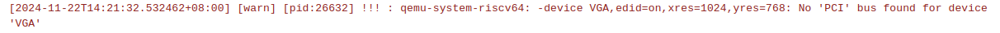
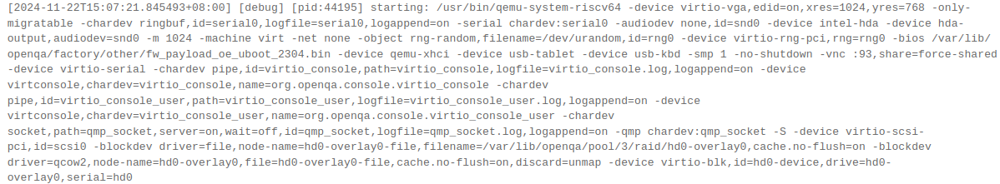
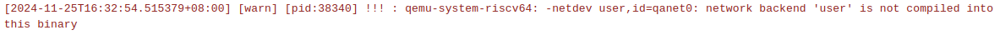
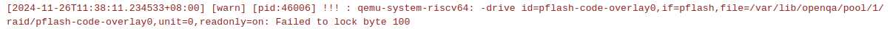
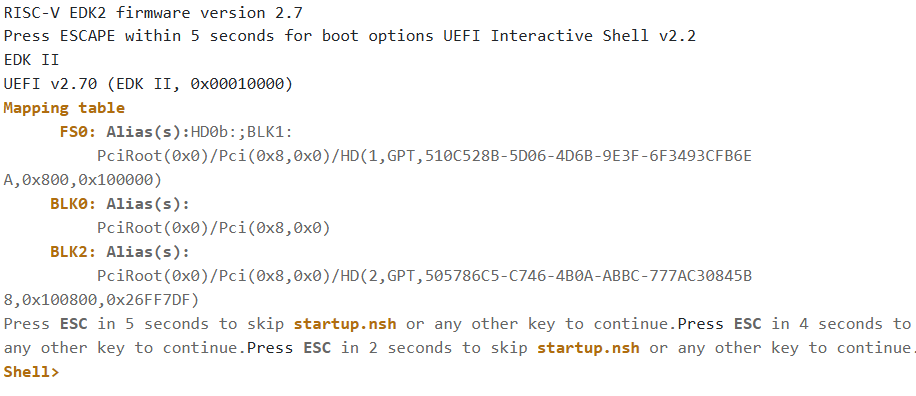
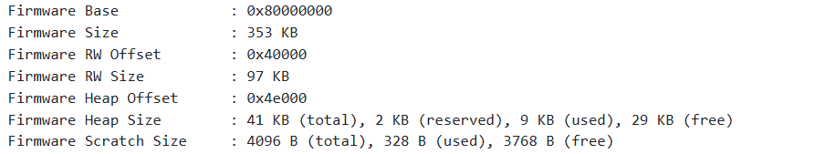
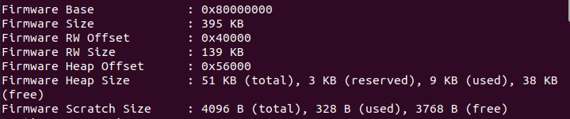

# openSUSE install qemu riscv

## 目标

在 openSUSE 上安装 qemu-system-riscv64

解决 openQA 启动 qemu 虚拟机的各种问题

## 安装步骤

### 安装依赖

```sh
zypper install ninja gcc gcc-c++ glib2-devel pixman-devel libfdt-devel zlib-devel libaio-devel libusb-1_0-devel
zypper install cmake
zypper install libSDL2-devel
```

验证是否成功安装sdl2

```sh
pkg-config --modversion sdl2
```

安装python，要求3.8版本以上

```sh
zypper install python39
```

### 源码编译

安装 qemu-9.0.1

```sh
wget https://download.qemu.org/qemu-9.0.1.tar.xz
tar xvJf qemu-9.0.1.tar.xz
cd qemu-9.0.1

./configure --prefix=/usr --target-list=riscv64-softmmu,riscv64-linux-user --enable-sdl --enable-slirp
make -j$(nproc)
sudo make install
```

上述命令会自动将 qemu-system-riscv64 安装到 /usr/bin 目录下

安装验证

```sh
qemu-system-riscv64 --version
```

## 问题解决

基于上述 qemu 配置运行测试出现以下问题：

```sh
!!! : qemu-system-riscv64: -vnc: invalid option
```


表示源码编译时没有启动VNC相关支持，为避免相似问题再次出现，查看 autoinst-log.txt 中的启动qemu虚拟机命令

```sh
starting: /usr/bin/qemu-system-riscv64 -device VGA,edid=on,xres=1024,yres=768 -only-migratable -chardev ringbuf,id=serial0,logfile=serial0,logappend=on -serial chardev:serial0 -audiodev none,id=snd0 -device intel-hda -device hda-output,audiodev=snd0 -m 1024 -cpu host -net none -object rng-random,filename=/dev/urandom,id=rng0 -device virtio-rng-pci,rng=rng0 -bios /var/lib/openqa/factory/other/fw_payload_oe_uboot_2304.bin -device qemu-xhci -device usb-tablet -device usb-kbd -smp 1 -enable-kvm -no-shutdown -vnc :93,share=force-shared -device virtio-serial -chardev pipe,id=virtio_console,path=virtio_console,logfile=virtio_console.log,logappend=on -device virtconsole,chardev=virtio_console,name=org.openqa.console.virtio_console -chardev pipe,id=virtio_console_user,path=virtio_console_user,logfile=virtio_console_user.log,logappend=on -device virtconsole,chardev=virtio_console_user,name=org.openqa.console.virtio_console_user -chardev socket,path=qmp_socket,server=on,wait=off,id=qmp_socket,logfile=qmp_socket.log,logappend=on -qmp chardev:qmp_socket -S -device virtio-scsi-pci,id=scsi0 -blockdev driver=file,node-name=hd0-overlay0-file,filename=/var/lib/openqa/pool/3/raid/hd0-overlay0,cache.no-flush=on -blockdev driver=qcow2,node-name=hd0-overlay0,file=hd0-overlay0-file,cache.no-flush=on,discard=unmap -device virtio-blk,id=hd0-device,drive=hd0-overlay0,serial=hd0
```

根据上述命令选项，需要在编译时启用相应qemu配置

```sh
./configure \
    --prefix=/usr \
    --target-list=riscv64-softmmu \
    --enable-kvm \
    --enable-vnc \
    --enable-sdl \
    --enable-debug \
    --enable-tools \
    --enable-system
```

需要确保安装以下依赖：

```sh
sudo zypper install -y \
    libSDL2-devel gtk3-devel \
    libvirt-devel libpixman-1-0-devel \
    alsa-devel glib2-devel \
    libiscsi-devel libusb-1_0-devel \
    libzstd-devel xz-devel libfdt-devel \
    ninja meson pkgconf
```

重新编译qemu

完成编译后，通过以下命令验证支持的选项：

```sh
qemu-system-riscv64 --help | grep vnc
```

重新运行测试，启动qemu虚拟机时出现问题：

```sh
!!! : qemu-system-riscv64: invalid accelerator kvm
```


问题定位：内核不支持 RISC-V 的 KVM

解决：在yaml文件中配置不启用kvm，设置 QEMU_NO_KVM: '1'

问题：


解决：在yaml文件中将QEMUCPU的值由host改为rv64

问题：



```sh
!!! : qemu-system-riscv64: -device VGA,edid=on,xres=1024,yres=768: No 'PCI' bus found for device 'VGA'
```

解决：yaml 文件中添加 QEMUVGA: virtio

```sh
!!! : qemu-system-riscv64: -device virtio-vga,edid=on,xres=1024,yres=768: No 'PCI' bus found for device 'virtio-vga'
```

仍出现上述问题

该问题根本原因是由于 QEMUMACHINE 选项未生效所致，其值`virt`不应使用双引号包含，修改后可成功启动 qemu 虚拟机



启动后系统无法连接网络

添加 user 网络方式，出现以下问题

```sh
!!! : qemu-system-riscv64: -netdev user,id=qanet0: network backend 'user' is not compiled into this binary
```



重新编译qemu，添加 user 后端

安装编译依赖项

```sh
zypper install libslirp-devel
```

编译qemu时启用user网络支持 `--enable-slirp`，上述命令已进行修改（同时这个选项也是支持 UEFI 所需要的）

### UEFI启动

使用UEFI启动的镜像时，需要对yaml进行修改，后续出现以下问题

```sh
!!! : qemu-system-riscv64: -drive id=pflash-code-overlay0,if=pflash,file=/var/lib/openqa/pool/1/raid/pflash-code-overlay0,unit=0,readonly=on: Failed to lock byte 100
```



通过以下命令发现系统启用了 AppArmor，这种额外安全策略限制了 QEMU 对文件的访问

```sh
sudo aa-status
```

`/usr/share/openqa/script/openqa` 和 `/usr/share/openqa/script/worker` 被 AppArmor 限制，且运行在 **enforce mode**。

解决：

1、临时禁用 AppArmor profiles

临时将相关 profile 切换到 complain mode（仅记录但不强制）：

```sh
sudo aa-complain /usr/share/openqa/script/openqa
sudo aa-complain /usr/share/openqa/script/worker
```

可以解决问题

2、完全禁用 AppArmor（貌似没效果）

```sh
sudo systemctl stop apparmor
sudo systemctl disable apparmor
```

完成上述设置之后，可以运行测试，但是无法进入系统，查看串口输出发现，未能成功引导系统启动



然后查看启动固件信息

```log
Firmware Base             : 0x80000000
Firmware Size             : 353 KB
Firmware RW Offset        : 0x40000
Firmware RW Size          : 97 KB
Firmware Heap Offset      : 0x4e000
Firmware Heap Size        : 41 KB (total), 2 KB (reserved), 9 KB (used), 29 KB (free)
Firmware Scratch Size     : 4096 B (total), 328 B (used), 3768 B (free)
```



qemu 正常从UEFI启动的固件信息

```log
Firmware Base             : 0x80000000
Firmware Size             : 395 KB
Firmware RW Offset        : 0x40000
Firmware RW Size          : 139 KB
Firmware Heap Offset      : 0x56000
Firmware Heap Size        : 51 KB (total), 3 KB (reserved), 9 KB (used), 38 KB (free)
Firmware Scratch Size     : 4096 B (total), 328 B (used), 3768 B (free)
```



能看出存在明显差异，尝试以此为切入口解决该问题
